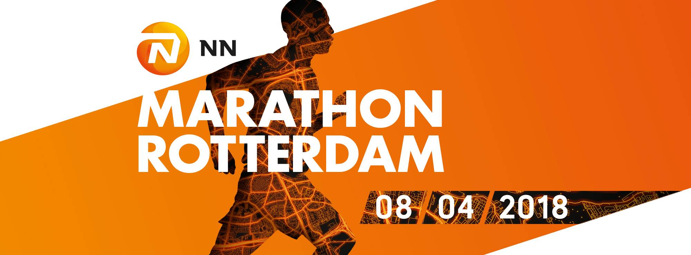

Overview
--------

**rotterdam-marathon** is an repository containing the R code that I used to create a timelapse of the Rotterdam Marathon, inspired by Alex Kruse who came up with this idea and created a [timelapse for the Hamburg marathon](https://twitter.com/krusealex2013/status/991604058396950528).  

This timelapse is created by first downloading the results of all runners through the API of the [Mylaps Sporthive website](https://results.sporthive.com/events/6386505967023513344/races/419161), and secondly a tcx file containg the course layout that I found on [Strava](https://www.strava.com/clubs/175948/group_events/294139). The tcx file contains a track that is 42,679 meters long, which is slightly longer than the actual marathon.

The data contains split times at 5, 10, 15, 20, 21.2, 25, 30, 35, 40 kilometers and the finish time. At every minute we check for every runner in which interval he is currently running, and based on this we linearly interpolate his cumulative distance covered. Subsequently, we find from the tcx file between which points the runner is currently running, and interpolate his latitude and longitude from there.

Result
------------

Usage
-----

